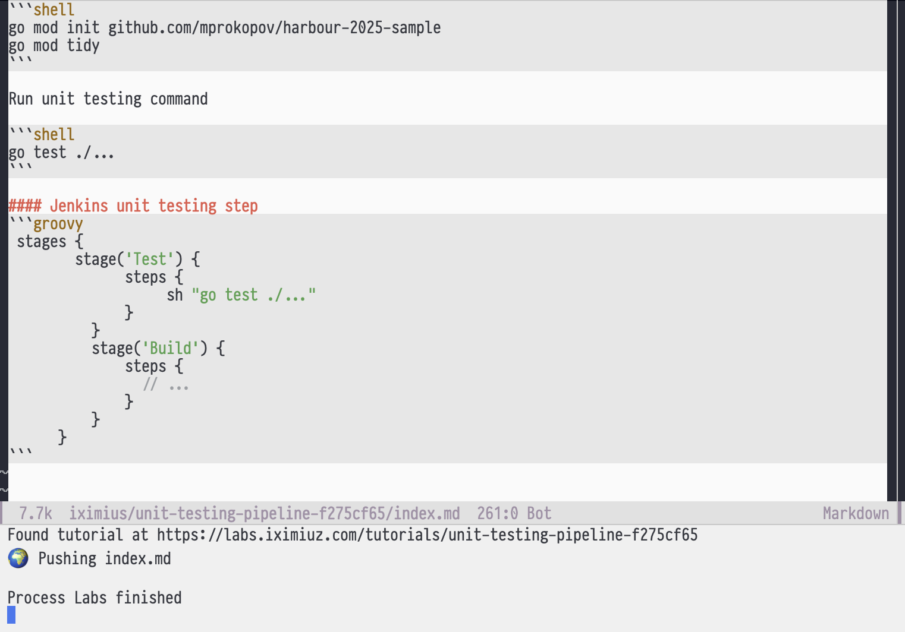

# labs.el - Iximius Labs Integration for Emacs

This package provides integration with Iximius Labs playgrounds and learning materials.


## Installation

You can install this package by downloading it directly:

```bash
git clone https://github.com/mprokopov/iximius-labs.el ~/.emacs.d/site-lisp/iximius-labs
```

Add to your Emacs configuration:

```elisp
(add-to-list 'load-path "~/.emacs.d/site-lisp/iximius-labs")
(require 'labs)
```

## Requirements

- Emacs 24.3 or later
- `labctl` command-line tool (must be installed and configured separately).
```shell
curl -sf https://labs.iximiuz.com/cli/install.sh | sh
```
- For macOS SSH integration: iTerm2

## Features

- Fetch and manage Iximius Labs playgrounds
- Terminate running playgrounds
- SSH into playgrounds directly from Emacs
- Push learning materials to Iximius Labs
- Browse current materials in your web browser
- Create new learning materials

## Usage

Enable the minor mode:

```elisp
M-x labs-mode
```

Navigate to the material page in browser `C-c c b` and run a playground. 

### Keybindings

When `labs-mode` is active:

- `C-c c p` - Push current material to Iximius Labs
- `C-c c b` - Browse current material in web browser

### Commands
- `M-x labs-push-current-material` - Push challenge, tutorial or course
- `M-x labs-fetch-playgrounds` - List all your playgrounds
- `M-x labs-terminate-playground` - Terminate the current playground
- `M-x labs-ssh-iterm` - SSH to the current playground using iTerm (macOS only)
- `M-x labs-create-material` - Create a new learning material (challenge, tutorial or course)

### Variables
- `labs-playground-id` - Current playground id
- `labs-playground-type` - Type of playground (challenge, tutorial, or course)

## License

Copyright (C) 2025 Maksym Prokopov

This package is licensed under the terms available in the repository.
